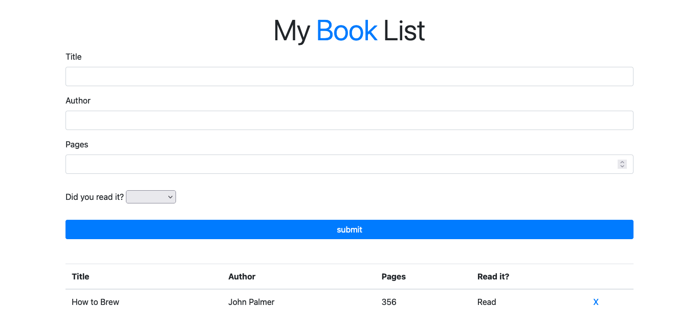

# Library v1.1

## About

The goal of this project was to create an application using JavaScript for creating a small Library app.

## Built with

- HTML
- CSS
- Bootstrap
- JavaScript

## Getting started

### Prerequisites

- Browser (Google Chrome, Mozilla Firefox, Safari or any other browser)
- Text editor (strongly recommended VS Code)
- Empty directory where the repo is to be cloned

### To get a local copy of this repo

Run the following comands in the terminal in the next order:

- Step 1:  
  $ cd "here comes the path of your selected directory (double quotes must not be here)"

- Step 2:
  $ git clone https://github.com/Wusinho/Library-JS.git

### To run this project in your local environment

- Step 1:
  Open index.html file in a browser.

- Step 2:
  Try it on!

### How to use the aplication

- Step 1:
  Fill the form.

- Step 2:
  You can remove your books from the table clicking on " X ".

## Authors

👤 **Heber Lazo**

- Github: [@Wusinho](https://github.com/Wusinho)
- LinkedIn: [Heber Lazo](https://www.linkedin.com/in/heber-lazo-benza-523266133/)

👤 **Carlos Flores**

- Github: [@Carlos-SSH](https://github.com/Carlos-SSH)
- LinkedIn: [Carlos-SSH](https://www.linkedin.com/in/Carlos-SSH/)

## 🤝 Contributing

Contributions, issues and feature requests are welcome!

Feel free to check the [issues page](https://github.com/Wusinho/Library-JS/issues).

## Acknowledgments

- Microverse
- The Odin Project
- Anyone whose detailed code inspired the creation of this project.

## 📝 License

This project is [MIT](license) licensed.

**
Give a ⭐️ if you like this project!

## Acknowledgments

- Microverse
- The Odin Project
- Anyone whose detailed code inspired the creation of this project.
